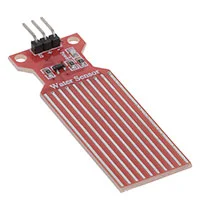
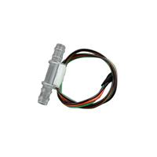
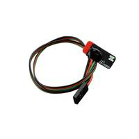
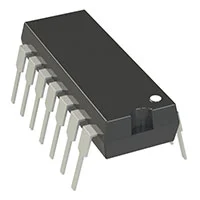
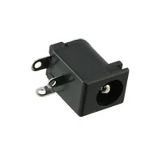
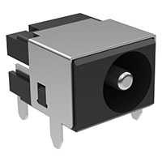

# Water Detection Sensor

### Adafruit 4965 — $1.95 each  

[Link to product](https://www.digikey.com/en/products/detail/adafruit-industries-llc/4965/14302510)

| Pros                          | Cons                                                                 |
|-------------------------------|----------------------------------------------------------------------|
| The design of the sensor is simple | Advised to be used as just an on/off sensor                        |
| Inexpensive                   | Needs solder on wires to not be connected squarely to the PCB       |
| Small footprint               |                                                                      |

---

### DFRobot SEN0509 — $10 each  

[Link to product](https://www.digikey.com/en/products/detail/dfrobot/SEN0509/15848101)

| Pros                                   | Cons                                               |
|----------------------------------------|----------------------------------------------------|
| Easily integrates into water pipe systems | More expensive                                   |
| Works with 5 volts                     | Designed for detecting leaks in pipe systems       |
|                                        | Biggest footprint of the 3 sensors                 |

---

### DFRobot SEN0508 — $9.90 each  

[Link to product](https://www.digikey.com/en/products/detail/dfrobot/SEN0508/15848084)

| Pros                             | Cons                                 |
|----------------------------------|--------------------------------------|
| Compact footprint                | More expensive                       |
| Built-in adhesive for mounting   | Datasheet is lacking information     |
| Device electronics are sealed    |                                      |

---

### Parallax Inc. 28090 — $5 each 
.jpg)

[Link to product](https://www.mouser.com/ProductDetail/Parallax/28090?qs=Cb2nCFKsA8qJcY7MqIdP3g%3D%3D&srsltid=AfmBOopLfP7KRIIOp0llsnb5oA7nMQJkm1ZVIjRc1vZQYESe-JeB_4lz)
[Secondary product link](https://www.parallax.com/product/mini-liquid-level-sensor/)

| Pros               | Cons                                                                 |
|--------------------|----------------------------------------------------------------------|
| Smallest footprint | Price is middle of the range                                         |
| Analog signal      | Needs solder on wires to not be connected squarely to the PCB        |
|                    | Cannot be ordered through Digi-Key                                   |

**Choice: Parallax Inc. 28090**  
**Rationale:** It is the only innate analog sensor out of the bunch, making it far more versatile. Its overall footprint and profile are better suited for the device being created.

---

#  Operational Amplifier

### Microchip Technology MCP6004T-I/OT — $0.59  

[Link to product](https://www.digikey.com/en/products/detail/microchip-technology/MCP6004-I-P/523060)

| Pros                                  | Cons                                     |
|---------------------------------------|------------------------------------------|
| Worked with it already in EGR 304     | Big footprint on the board               |
| Already have an IC of this model      | 4 op amps within the IC, some may go unused |
| 4 op amps within the IC               |                                          |

---

### Microchip Technology MCP6004T-I/OT — $0.30  
.webp)

[Link to product](https://www.digikey.com/en/products/detail/microchip-technology/MCP6001T-I-OT/551760)

| Pros                              | Cons                                      |
|-----------------------------------|-------------------------------------------|
| Smaller footprint                 | Only 1 op amp within the IC               |
| Only 1 op amp within the IC       | 5 pins, so the footprint needs to be symmetric |
| Small version of the first IC     |                                           |

**Choice: Microchip Technology MCP6004T-I/OT**  
**Rationale:** It's a readily available part handed out in EGR 304. The footprint is already made in KiCad, reducing PCB design effort. The 4 op amps allow for future system expansion.

---

# Linear Voltage Regulator

### TAEJIN LM7805T — $0.33 (bulk)  
.webp)

[Link to product](https://www.digikey.com/en/products/detail/taejin/LM7805T/22237260)

| Pros                              | Cons                          |
|-----------------------------------|-------------------------------|
| Worked with this regulator in class | Only 1.5 amps of current output |
| Already have a regulator of this model | Needs 8 mA of current         |

---

### Texas Instruments LM78L05ACZ/LFT7 — $0.51  
~LP~3_sml(200x200).webp)

[Link to product](https://www.digikey.com/en/products/detail/texas-instruments/LM78L05ACZ-LFT7/3640764)

| Pros                                      | Cons                          |
|-------------------------------------------|-------------------------------|
| Smaller footprint                         | 100 milliamps current output  |
| Cheaper than the first option, no bulk needed |                               |
| Only needs 3 mA of current                |                               |

---

### Onsemi MC7805CTG — $0.51  
.webp)

[Link to product](https://www.digikey.com/en/products/detail/onsemi/MC7805CTG/919333)

| Pros                                      | Cons              |
|-------------------------------------------|-------------------|
| Cheaper than the first option, no bulk needed | 1 amp of current |
| Only needs 6.5 mA of current              |                   |

**Choice: Same Sky PJ-102AH**  
**Rationale:** Readily available from the EGR 304 kit. Footprint is pre-made in KiCad, simplifying PCB manufacturing.

---

# Power Supply

### Same Sky PJ-102AH — $0.76
.webp)

[Link to product](https://www.digikey.com/en/products/detail/cui-devices/PJ-102AH/408448)

| Pros                                              | Cons                                               |
|---------------------------------------------------|----------------------------------------------------|
| Readily available via EGR 304 kit                 | Third pin not useful for PCB, adds extra drill hole |
| Works with 2mm power jack plug-ins                |                                                    |
| 24 VDC output, 5 Amp                              |                                                    |

---

### Same Sky PJ-002B — $0.52  

[Link to product](https://www.digikey.com/en/products/detail/same-sky-formerly-cui-devices/PJ-002B/96965)

| Pros                              | Cons                                               |
|-----------------------------------|----------------------------------------------------|
| Outputs 24 VDC 2.5 Amp            | Third pin not useful for PCB, adds extra drill hole |
| Costs less than PJ-102AH         | Uses a 2.5mm jack                                  |

---

### Tensility International Corp 54-00127 — $0.76  

[Link to product](https://www.digikey.com/en/products/detail/tensility-international-corp/54-00127/9685436)

| Pros                              | Cons                                               |
|-----------------------------------|----------------------------------------------------|
| Outputs 48 VDC 6 Amp              | Third pin not useful for PCB, adds extra drill hole |
| Costs the same as PJ-102AH       | Uses a 5.5mm jack                                  |

** Choice: Same Sky PJ-102AH**  
**Rationale:** Readily available from the EGR 304 kit and compatible with the wall plug provided in class.            |
    | Meets surface mount constraint of project |

