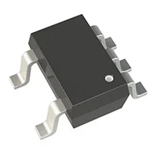
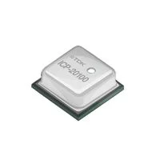
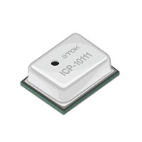

## Module's Selected Major Components

# Voltage Regulator

1. **LM2575D2T-3.3R4G**

· $2.16 per unit  
· [Link to product](https://www.digikey.com/en/products/detail/onsemi/LM2575D2T-3-3R4G/1476688)

| Pros | Cons |
|------|------|
| 1 amp | Lowish frequency |
| High max input threshold (42v) | 1 output |
| Lower frequency, resulting in higher efficiency | |

---

2. AP63203WU-7

· $0.71  
· [Link to product](https://www.digikey.com/en/products/detail/diodes-incorporated/AP63203WU-7/9858426)

| Pros |  | Cons |
|------|--|------|
| Small footprint | | Small size overall, making soldering harder |
| 2 amps | High frequency, so less efficient |
| High frequency means low noise | |

---

3. **ADP2108AUJZ-3.3-R7**

· $2.44  
· [Link to product](https://www.digikey.com/en/products/detail/analog-devices-inc/ADP2108AUJZ-3-3-R7/2042669)

| Pros | Cons |
|------|------|
| Small footprint | Small size overall, making soldering harder |
| High frequency | Low amperage |
|  | High frequency |

### **Choice: LM2575D2T-3.3R4G**

Rationale: I am choosing the LM2575 for a few reasons. First, it is a low-frequency component, as it is a bigger component but more efficient than the other two. Additionally, it introduces less "noise" into the system as a whole. The documentation for it is quite good. Its max input voltage is quite high, meaning that if a group member needs to use a higher voltage throughout the system, my subsystem won't need to see any changes. The 1 amp it provides is more than enough. Lastly, this is the surface-mount model of the switching regulator we used in EGR 314, making its setup quite familiar.

---

# Sensor

1. **ICP-20100**

· $2.92  
· [Link to product](https://www.digikey.com/en/products/detail/tdk-invensense/ICP-20100/16379591)
· $14.00  
· [Link to breakout board](https://www.digikey.com/en/products/detail/mikroelektronika/MIKROE-5153/16528235)

| Pros | Cons |
|------|------|
| Breakout board, so foot footprint is small on pcb | Needs the breakout board; otherwise, soldering is too hard |
| Offers I2c, I3c, and spi options | |
| Good documentation | |

---

2. **ICP-10111**

· $2.70  
· [Link to product](https://www.digikey.com/en/products/detail/tdk-invensense/ICP-10111/9555753)  
· $14.00  
· [Link to breakout board](https://www.digikey.com/en/products/detail/mikroelektronika/MIKROE-4868/16182503)

| Pros | Cons |
|------|------|
| Breakout board, so foot footprint is small on pcb | Needs the breakout board; otherwise, soldering is too hard |

---

3. **PSD0401120**
   

· $6.78  
· [Link to product](https://www.digikey.com/en/products/detail/pui-audio-inc/PSD0401120/25575516)

| Pros | Cons |
|------|------|
| Small footprint | Soldering is harder cause it's small |
| Good documentation | |

---

# Power Supply

1. **Same Sky PJ-102AH**
   

· $0.76  
· [Link to product](https://www.digikey.com/en/products/detail/cui-devices/PJ-102AH/408448)

| Pros | Cons |
|------|------|
| Readily available with the kit provided by the class EGR 304 | A third pin that is not useful for the PCB being created, so it's just an extra drill hole in the PCB |
| Works with 2mm power jack plugs ins | |
| 24 VDC output, 5Amp | |

---

2. **Same Sky PJ-002B**
   

· $0.52  
· [Link to product](https://www.digikey.com/en/products/detail/same-sky-formerly-cui-devices/PJ-002B/96965)

| Pros | Cons |
|------|------|
| Outputs 24 Vdc 2.5 amp | A third pin that is not useful for the PCB being created, so it's just an extra drill hole in the PCB |
| Costs less then than the previous option | Uses a 2.5mm jack |

---

3. **Tensility International Corp 54-00127**
   

· $0.76  
· [Link to product](https://www.digikey.com/en/products/detail/tensility-international-corp/54-00127/9685436)

| Pros | Cons |
|------|------|
| Outputs 48 Vdc 6 amp | A third pin that is not useful for the PCB being created, so it's just an extra drill hole in the PCB |
| Costs the same as the first option | Uses a 5.5mm jack |

---

### **Choice: Same Sky PJ-102AH**

Rationale: The J-102AH is the chosen option for a few simple reasons. In addition to accepting a 24-volt supply, it uses a 2 mm barrel jack, making it compatible with a few different power supplies. Outside of that, it is the barrel jack I am most familiar with using when it comes to designing boards. Additionally, it is the standard jack given out in the EGR 314 class, making replacements plentiful.

---

# Microcontroller

**Choice: Esp-32**
