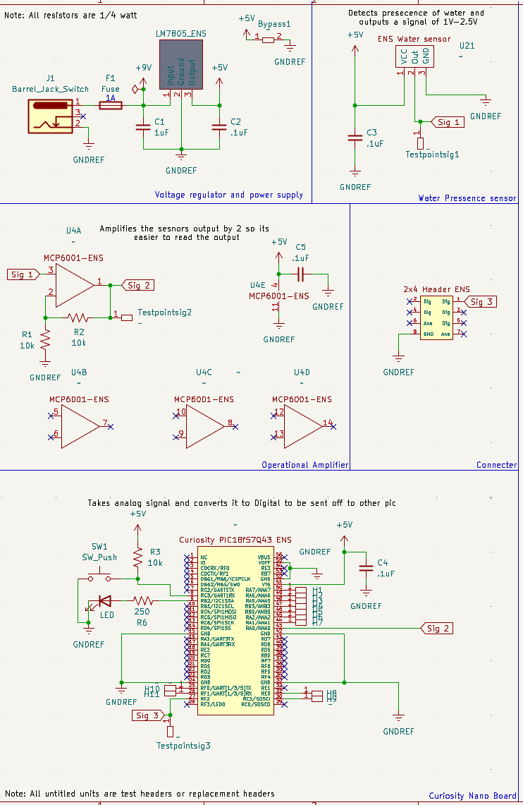
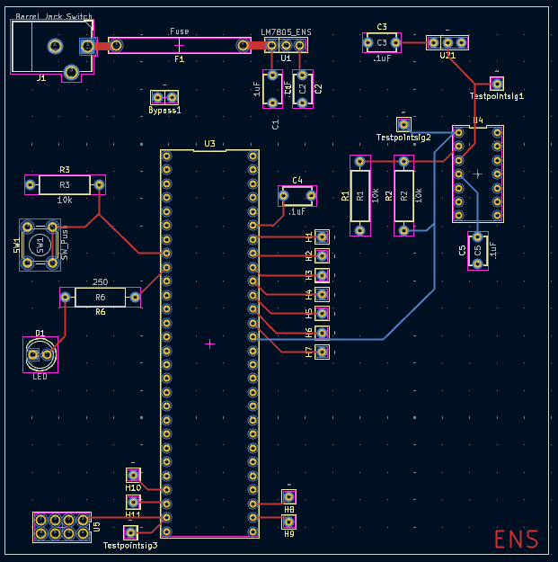

## Overview

This schematic is design to support a analog water level sesnor, amplify its signal, and then convert into digital to be sent off to a seperate board.

The schematic as a PDF download is available [*here*](Final.pdf)

The PCB as a pdf download is available  [*here*](Finalpcb.pdf) Along with the zip file for the whole project [*here*](ElisabethNSabbagh208.zip). And finally the Gerber and Drill files for the PCB [*here*](ENSGerber208.zip).
