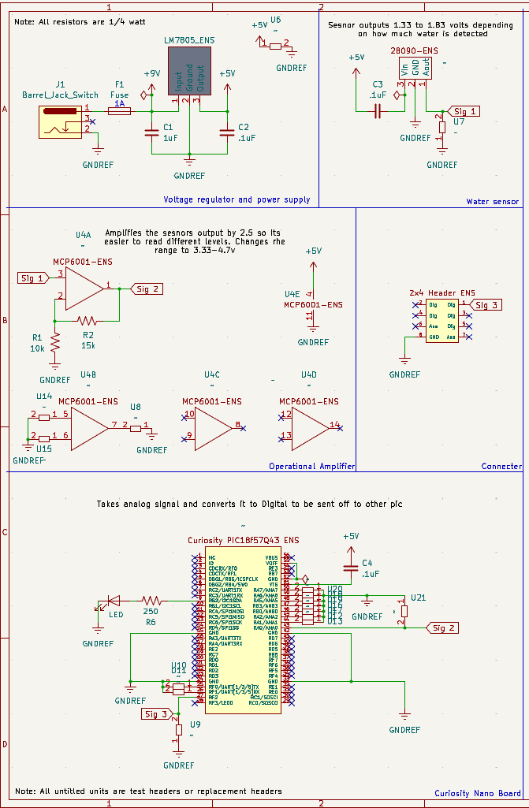

## Overview

This schematic is design to support a analog water level sesnor, amplify its signal, and then convert into digital to be sent off to a seperate board.

The schematic as a PDF download is available [*here*](v1.pdf), and the Zip folder of the project [*here*](dummyZip.zip).
