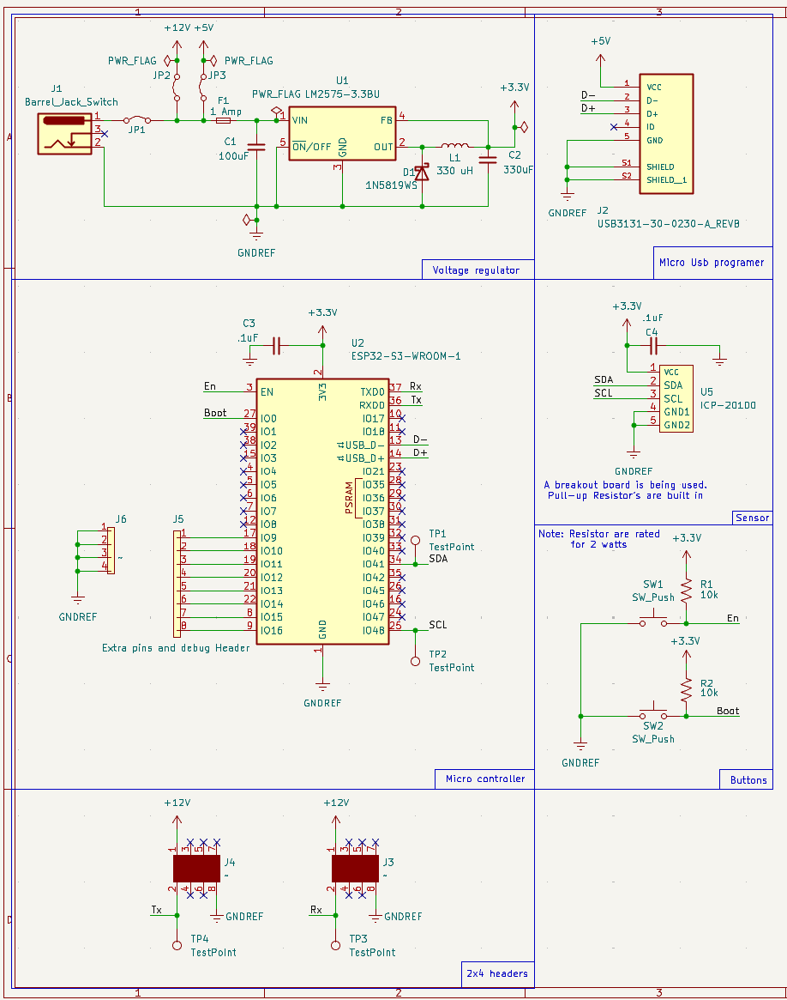

## Overview

This schematic is design to support a pressure sensor. Along with passing the data along to the other boards within the entire system

{style width:"350" height:"300;"}
**Figure 1** Showing a example schematic.

## Resouces

The pdf of the schematic is [*here*](Ens-egr314-sch.pdf). The Zip folder of the project [*here*](Ens-Egr314.zip).
