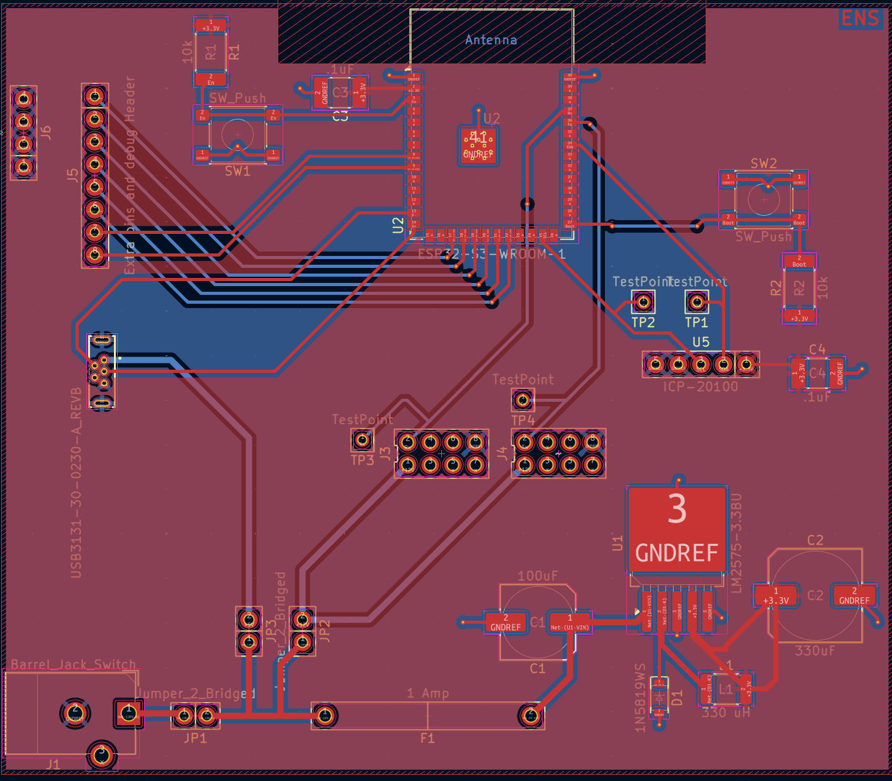

## PCB

This pcb is designed to support a pressure sensor. Along with passing the data along to the other boards within the entire system

{style width:"350" height:"300;"}
**Figure 1** The pcb.

## Resouces

The pdf of the pcb is [*here*](Ens-egr314-pcb.pdff). The Zip folder of the project [*here*](Ens-Egr314.zip). The gerber and drill files of the pcb are [*here*](ENS-EGR314-GBR.zip)
